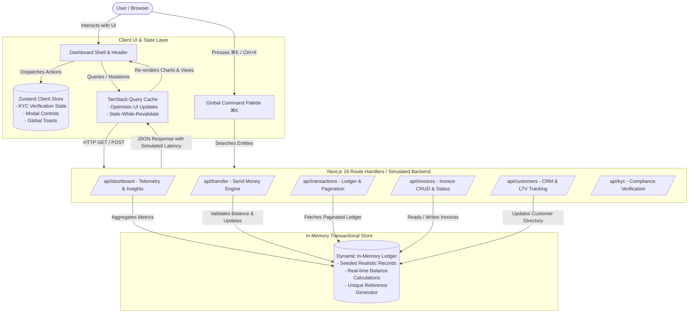

# 💳 FinFlow — Modern Fintech & Treasury Command Center

<div align="center">


**A sleek, production-grade financial command center designed for freelancers, creators, and modern digital businesses.**

[Overview](#-overview) • [How It Works](#-how-it-works-system-architecture--workflows) • [Key Features](#-key-features) • [Tech Stack](#-tech-stack--architecture) • [Getting Started](#-getting-started) • [Deploy to Render](#-deployment-to-render-step-by-step)

</div>

---

## 🌟 Overview

**FinFlow** is an executive financial command center and treasury operations dashboard. Rather than behaving like a static mock or a basic bank page, FinFlow is built as a complete, responsive product that simulates real-world fintech operations:

* **Monitors live financial telemetry**: Balance, monthly inflows/outflows, burn rate, and profit margins across multiple time horizons (`7d`, `30d`, `3m`, `1y`).
* **Simulates instant money movement**: Send money with fee calculators, recipient validation, and instant ledger balance updates.
* **Manages end-to-end billing**: Issue itemized invoices, calculate taxes and discounts, filter by status, and export client-ready previews.
* **Maintains a Customer CRM**: Track client transaction volumes, lifetime value (LTV), and launch direct billing actions.
* **Guides users through KYC compliance**: 4-stage identity onboarding (Personal Info, ID Document Scan, Biometric Liveness Check, Address Verification) with real-time account limit upgrades.
* **Accelerates workflow via Command Palette (`⌘K`)**: Quick navigation, instant search across clients/invoices/transactions, and modal shortcuts.

---

## ⚙️ How It Works (System Architecture & Workflows)



---

### 1. Financial Telemetry & Balance Engine
* **How It Works**: When the dashboard loads, `useQuery` calls `/api/dashboard` with an artificial network delay (600ms) to trigger smooth skeleton loaders.
* **Metrics Calculation**:
  * **Total Balance**: Reflects current operating liquidity in real time. Any money sent or received dynamically adjusts this total.
  * **Inflow & Outflow**: Categorizes transactions into `income` (client retainers, milestone payments) vs. `expense` (software subscriptions, payroll, cloud infrastructure).
  * **Net Profit Margin**: Calculated dynamically as:
    $$\text{Net Profit} = \text{Total Inflow} - \text{Total Outflow}$$
  * **Timeframe Filters**: Switching between `7D`, `30D`, `3M`, and `1Y` updates the Recharts area and bar graphs to reflect historical trajectories.

---

### 2. Simulated Money Movement & Transfer Engine
* **How It Works**:
  1. The user clicks **"Send Money"** or triggers it via `⌘K`.
  2. The transfer modal prompts for recipient name, destination account, amount, category, and payment reference memo.
  3. **Live Fee Calculator**: The form dynamically calculates processing fees (0.5%) and net debit totals before confirmation.
  4. **Balance Validation**: The API validates that the requested amount does not exceed the available balance. If invalid, a descriptive error is returned.
  5. **Ledger Update & Confetti**: Upon success, a unique transaction ID (`TXN-XXXXXXFF`) is minted, added to the in-memory ledger, the balance is deducted, and a confetti animation is triggered alongside a success toast.

---

### 3. Invoice Lifecycle & PDF Export Pipeline
* **How It Works**:
  1. **Creation**: The user builds multi-line invoices by selecting an existing client from the CRM, entering service descriptions, quantities, and unit rates.
  2. **Automated Calculations**: The modal dynamically computes:
     $$\text{Subtotal} = \sum (\text{Qty} \times \text{Unit Price}), \quad \text{Total} = \text{Subtotal} + \text{Tax} - \text{Discount}$$
  3. **Status Progression**: Invoices progress through a defined state machine:
     $$\text{Draft} \longrightarrow \text{Pending} \longrightarrow \text{Paid} \quad \text{or} \quad \text{Overdue}$$
  4. **Simulated Export**: Generates a clean printable/PDF view formatted with business metadata, client details, and itemized receipts.

---

### 4. Customer Directory & Lifetime Value (LTV) CRM
* **How It Works**:
  * Each customer record tracks their total payments, active invoice count, contact info, and company affiliation.
  * Clicking on any customer profile gives immediate action shortcuts: **"Request Payment"** or **"Create Invoice"**, pre-populating client metadata into modals.

---

### 5. 4-Stage KYC Compliance & Tiered Limits
* **How It Works**:
  * FinFlow features a full KYC onboarding flow managed via Zustand client state:
    * **Stage 1 (Personal Info)**: Legal name, date of birth, phone number.
    * **Stage 2 (Identity Document)**: Upload simulation for National ID, Driver's License, or International Passport with simulated OCR parsing.
    * **Stage 3 (Biometric Check)**: Simulated webcam facial recognition scan.
    * **Stage 4 (Proof of Address)**: Utility bill / bank statement verification.
  * **Live Account Tier Upgrade**: Completing verification updates the user's status to `Verified`, displays a verified badge on the dashboard, and raises daily transfer limits from ₦500,000 to ₦10,000,000.

---

### 6. Quick Command Palette (`⌘K` / `Ctrl+K`)
* **How It Works**:
  * A global keyboard listener listens for `⌘K` (macOS) or `Ctrl+K` (Windows/Linux).
  * Opens a spotlight modal with instant fuzzy search across:
    * **Navigation**: Jump directly to Overview, Transactions, Analytics, Invoices, Customers, KYC, or Settings.
    * **Actions**: Open Send Money, Request Payment, Add Customer, or Create Invoice modals.
    * **Records**: Search transactions by reference code, recipient, or category.

---

### 7. Adaptive Theming & Mobile-First Architecture
* **How It Works**:
  * Powered by **Tailwind CSS v4** `@custom-variant dark` with root class toggling.
  * Stores theme preferences in `localStorage` to avoid flash-of-unstyled-content (FOUC).
  * Responsive layout with a collapsible sidebar for desktop and an optimized bottom drawer and compact navigation bar for mobile screens.

---

## ✨ Key Features

| Feature | Description |
| :--- | :--- |
| 📊 **Command Center** | Real-time balance cards, cash flow trajectory, and AI financial insights. |
| 💸 **Instant Transfers** | Dynamic fee calculator, live currency conversion, and instant ledger updates. |
| 📄 **Invoice Engine** | Multi-item invoice builder with status lifecycle filters (`Paid`, `Pending`, `Draft`, `Overdue`). |
| 👥 **Customer CRM** | Client directory with lifetime value (LTV) tracking and direct billing actions. |
| 📈 **Deep Analytics** | Recharts visual graphs for income vs. expense, burn rate, and category breakdowns. |
| 🪪 **4-Stage KYC** | Complete compliance onboarding with biometric simulation and tier upgrades. |
| 🔍 **Command Palette** | Floating `⌘K` / `Ctrl+K` spotlight search and quick action trigger. |
| 🌓 **Dark & Light Mode** | Seamless, accessible theme switching with zero hydration mismatch. |

---

## 🛠 Tech Stack & Architecture

| Layer | Technology | Purpose |
| :--- | :--- | :--- |
| **Framework** | [Next.js 16](https://nextjs.org/) (App Router) | React Server Components, Route Handlers, optimized SSR |
| **Language** | [TypeScript 5](https://www.typescriptlang.org/) | Strict type safety across all UI components and API endpoints |
| **Styling** | [Tailwind CSS v4](https://tailwindcss.com/) | Modern CSS variables, `@custom-variant dark`, responsive utilities |
| **Data Fetching** | [TanStack Query v5](https://tanstack.com/query/latest) | Server-state caching, optimistic updates, query invalidation |
| **Client State** | [Zustand](https://github.com/pmndrs/zustand) | Global modal triggers, KYC verification flow, notification store |
| **Charts** | [Recharts](https://recharts.org/) | Responsive SVG Area, Bar, and Donut charts |
| **Icons** | [Lucide React](https://lucide.dev/) | Clean, minimalist vector iconography |
| **Animations** | [Framer Motion](https://www.framer.com/motion/) & [Canvas Confetti](https://www.npmjs.com/package/canvas-confetti) | Polished transitions and micro-delights |
| **Form Validation** | [Zod](https://zod.dev/) & [React Hook Form](https://react-hook-form.com/) | Client-side input validation and error feedback |
| **Mock Engine** | [@faker-js/faker](https://fakerjs.dev/) | Dynamic realistic financial telemetry and customer datasets |

---

## 📂 Project Structure

```text
fintech/
├── src/
│   ├── app/
│   │   ├── api/                  # Simulated API Route Handlers
│   │   │   ├── analytics/        # Cash flow, burn rate & breakdown endpoints
│   │   │   ├── customers/        # Customer directory & CRM records
│   │   │   ├── dashboard/        # Executive overview & summaries
│   │   │   ├── invoices/         # Invoice records & lifecycle endpoints
│   │   │   ├── kyc/              # Verification status endpoints
│   │   │   ├── transactions/     # Transaction ledger & pagination
│   │   │   │   └── [id]/         # Single transaction lookup
│   │   │   └── transfer/         # Simulated money movement & transfers
│   │   ├── dashboard/            # App Router Pages
│   │   │   ├── analytics/        # Analytics & financial breakdown
│   │   │   ├── customers/        # Customer CRM & client ledger
│   │   │   ├── invoices/         # Invoices overview & creator
│   │   │   ├── settings/         # User & business profile settings
│   │   │   ├── transactions/     # Transaction history & ledger
│   │   │   ├── verification/     # KYC identity verification flow
│   │   │   ├── layout.tsx        # Dashboard shell with sidebar & header
│   │   │   └── page.tsx          # Executive dashboard overview
│   │   ├── globals.css           # Tailwind v4 theme configuration
│   │   └── layout.tsx            # Root layout & providers
│   ├── components/
│   │   ├── analytics/            # Cash flow & breakdown chart components
│   │   ├── customers/            # Customer table & detail cards
│   │   ├── dashboard/            # Executive summary cards & recent activity
│   │   ├── invoices/             # Invoice table & creation modal
│   │   ├── layout/               # Header, Sidebar, Command Palette (⌘K)
│   │   ├── transactions/         # Send/Request money modals & drawers
│   │   ├── ui/                   # Logo, buttons, inputs, badge primitives
│   │   └── verification/         # KYC step components & progress bars
│   ├── lib/
│   │   ├── mock-data/
│   │   │   ├── seed.ts           # Initial baseline mock datasets
│   │   │   └── store.ts          # Shared in-memory transactional store
│   │   └── utils.ts              # Currency formatters, date helpers, cn utility
│   ├── store/                    # Zustand stores (KYC, UI state)
│   └── types/                    # TypeScript interfaces & data models
├── public/                       # Static assets & icons
├── package.json
├── tsconfig.json
└── README.md
```

---

## 🚀 Getting Started

### Prerequisites
- **Node.js**: `v20.x` or `v22.x` (LTS recommended)
- **npm**: `v10.x` or higher

### 1. Clone the Repository
```bash
git clone https://github.com/YOUR_USERNAME/finflow.git
cd finflow
```

### 2. Install Dependencies
```bash
npm install
```

### 3. Run the Development Server
```bash
npm run dev
```

Open [http://localhost:3000](http://localhost:3000) in your browser. The app will automatically redirect to the `/dashboard/overview` command center.

### 4. Build for Production
```bash
npm run build
npm start
```

---

## 🌐 Deployment to Render (Step-by-Step)

Deploying **FinFlow** as a **Node.js Web Service** on Render takes under 3 minutes:

### Step 1: Push Code to GitHub
1. Create a new empty repository on [GitHub](https://github.com/new) (e.g., `finflow`).
2. Run the following in your local terminal:
```bash
git init
git add .
git commit -m "feat: complete FinFlow executive fintech dashboard"
git branch -M main
git remote add origin https://github.com/YOUR_USERNAME/YOUR_REPOSITORY_NAME.git
git push -u origin main
```

---

### Step 2: Create a Web Service on Render
1. Go to your [Render Dashboard](https://dashboard.render.com/) and log in.
2. Click **New +** in the top right corner and select **Web Service**.
3. Select **Build and deploy from a Git repository** and connect your GitHub account.
4. Select your `finflow` repository.

---

### Step 3: Configure Service Settings

Fill in the configuration fields as follows:

| Setting Field | Value |
| :--- | :--- |
| **Name** | `finflow` *(or any unique name you prefer)* |
| **Language** | `Node` |
| **Branch** | `main` |
| **Region** | Select the region closest to you *(e.g., Frankfurt, Oregon, Ohio)* |
| **Root Directory** | *(Leave blank / default)* |
| **Build Command** | `npm install && npm run build` |
| **Start Command** | `npm start` |
| **Instance Type** | `Free` *(or Starter)* |

---

### Step 4: Set Environment Variables *(Under "Environment Variables")*
Add the following keys to ensure seamless runtime compatibility on Render:

| Key | Value |
| :--- | :--- |
| `NODE_VERSION` | `20.18.0` |
| `NODE_ENV` | `production` |

---

### Step 5: Deploy
1. Click **Create Web Service**.
2. Render will automatically clone your repository, install dependencies, run the Next.js production build, and launch the service.
3. Once the build completes, your live application URL will be displayed (e.g., `https://finflow-xxxx.onrender.com`).

---

## 🛡 License

This project is licensed under the **MIT License**. See the [LICENSE](LICENSE) file for details.

---

<div align="center">
Built with precision using Next.js 16, TypeScript, and Tailwind CSS.
</div>
